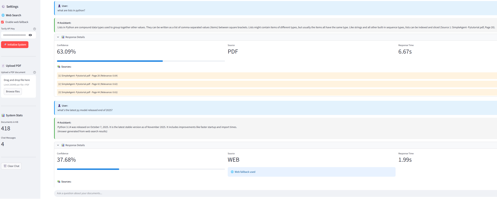

# 📚 SimpleAgent - RAG System for Document Q&A

A local-first Retrieval-Augmented Generation system that answers questions about your PDF documents, with automatic web search fallback when confidence is low.



## 🎯 Features

- **PDF Ingestion** - Upload PDFs, automatically chunked and embedded
- **Semantic Search** - Find relevant content using vector similarity (ChromaDB)
- **Local LLM** - Answers generated by Mistral 7B via Ollama (runs on your GPU)
- **Smart Fallback** - Automatic web search (Tavily) when PDF content is insufficient
- **Confidence Scoring** - Transparent decision-making on source selection
- **Streamlit UI** - Clean web interface for easy interaction

## 🏗️ Architecture
```
PDF → Chunking → Embeddings (GPU) → ChromaDB
                                        ↓
User Query → Semantic Search → Confidence Check → LLM Response
                                    ↓ (if low)
                               Web Search (Tavily)
```

## 🛠️ Tech Stack

| Component | Technology |
|-----------|------------|
| Embeddings | Sentence-Transformers (all-MiniLM-L6-v2) |
| Vector DB | ChromaDB |
| LLM | Mistral 7B via Ollama |
| Web Search | Tavily API |
| UI | Streamlit |
| GPU Acceleration | PyTorch CUDA |

## 📦 Installation
```bash
# Clone repository
git clone https://github.com/yourusername/SimpleAgent.git
cd SimpleAgent

# Create virtual environment
python -m venv venv
venv\Scripts\activate  # Windows
# source venv/bin/activate  # Linux/Mac

# Install dependencies
pip install -r requirements.txt

# Install Ollama and pull Mistral
# https://ollama.ai
ollama pull mistral:7b
```

## 🚀 Usage

1. Start Ollama:
```bash
ollama serve
```

2. Run the app:
```bash
streamlit run streamlit_ui.py
```

3. Open `http://localhost:8501` in your browser

4. (Optional) Add your Tavily API key for web search fallback

## 📁 Project Structure
```
SimpleAgent/
├── data/                     # PDF storage
├── chroma_db/                # Vector database (auto-generated)
├── venv_SimpleAgent/         # Virtual environment
├── __pycache__/              # Python cache
├── .gitignore
├── LICENSE
├── readme.md
├── requirements.txt
├── ingestion.py              # PDF loading and chunking
├── embeddings.py             # Vector embeddings + ChromaDB
├── query_system.py           # Semantic search + confidence scoring
├── llm_handler.py            # Ollama/Mistral integration
├── web_search_handler.py     # Tavily API fallback
├── rag_pipeline.py           # Main orchestration logic
├── main.py                   # CLI entry point
└── streamlit_ui.py           # Web UI
```

## 🔒 Privacy

All processing happens locally on your machine. PDFs never leave your computer. Only web search queries are sent externally (when fallback is triggered).

## 📝 License

MIT - see [LICENSE](LICENSE) for details